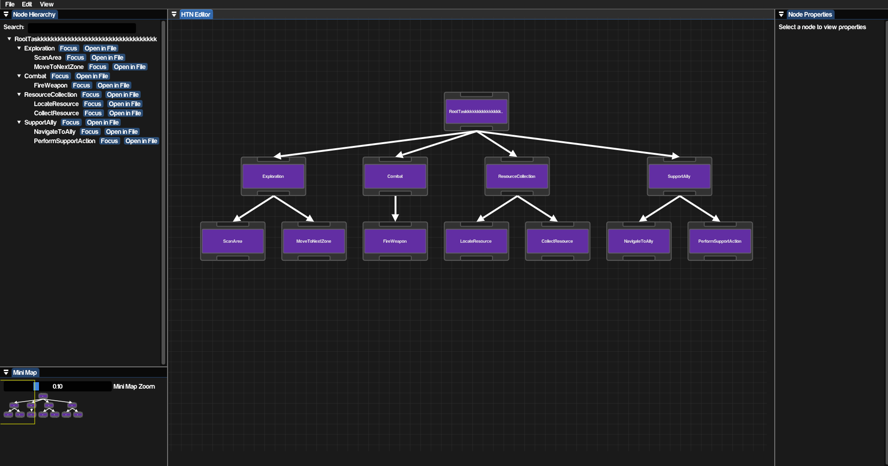

# HTN Visualizer

A **Hierarchical Task Network (HTN) visualization and debugging tool** written in C++ with Dear ImGui.

HTN is a planning model widely used in game AI, where an agent's high-level goal is broken down into smaller, executable tasks ("move to target", "fire weapon"). This tool was built to inspect, navigate, and debug such a task tree in real time.

> **Note:** This project is a personal, from-scratch version of a similar AI debugging tool I needed on AAA production (IO Interactive, *007: First Light*). It contains no proprietary code, data formats, or assets from that work.

## Features



- **Node Hierarchy** - a searchable list view of the full tree, from compound tasks (e.g. `Exploration`, `Combat`, `ResourceCollection`, `SupportAlly`) down to primitive tasks (e.g. `ScanArea`, `FireWeapon`, `LocateResource`). Every node has `Open in File` to jump straight to its source, and `Focus` to centre it on the canvas.
- **Visual Node Graph** - task decomposition rendered in real time on a draggable node canvas, with parent-child links drawn as arrows. The graph, its layout, hit-testing, panning and zooming are implemented directly on top of Dear ImGui rather than using an off-the-shelf node-editor library.
- **Node Properties Panel** - live inspection of a selected task's name, type, and custom parameters (e.g. `EngagementRange: 300.0` on the `Combat` task).
- **Mini Map** - zoomable overview for fast navigation on larger trees.

## Why I built it

At IO Interactive, our AI behavior definitions lived in an in-house DSL built almost entirely out of macros and strings. That meant AI programmers had no symbol navigation in the IDE, finding a specific task in a large tree meant text-searching through it by hand. I built a proof-of-concept visualizer there to make that tree browsable and debuggable at a glance, with the long-term idea of growing it into something closer to Unreal Engine's Behavior Tree editor. Eventually letting you author and create tasks directly from the editor, not just inspect them.

This repository is my own independent take on that same problem: browsing a large, otherwise hard-to-navigate task tree visually. It's built from scratch with my own architecture, DSL, and serialization format, solving it end-to-end on my own time, with nothing carried over from the internal codebase.

## Project Layout

```
HTNVisualizer/
  include/htn/core/          task tree model and DSL parser
  include/htn/editor/        UI, interactions, theming, ImGui helpers
  include/htn/app/           application shell
  include/htn/xmlgenerator/  XML serialization
  src/                       matching implementation files
  extern/                    third-party libraries
  resources/                 fonts, icons, and a sample behaviour.xml
```

## Tech

- C++17
- Dear ImGui (the node graph itself is hand-written on top of it)
- GLFW, tinyxml2
- CMake

## Building

Requires CMake 3.15+ and a C++17 compiler. Currently Windows-only, as the project links directly against `opengl32`.

```bash
git clone https://github.com/EsgiJ/HTN_Visualizer.git
cd HTN_Visualizer/HTNVisualizer
cmake -B build -S .
cmake --build build --config Release
```

All third-party dependencies are vendored under `extern/`, so no extra setup step is needed.

## Third-party libraries

None of the following are my work; everything else in this repository is.

| Library | Purpose |
|---|---|
| [Dear ImGui](https://github.com/ocornut/imgui) | immediate-mode UI |
| [GLFW](https://www.glfw.org) | window and OpenGL context |
| [tinyxml2](https://github.com/leethomason/tinyxml2) | XML parsing |
| [IconFontCppHeaders](https://github.com/juliettef/IconFontCppHeaders) | icon font headers |
